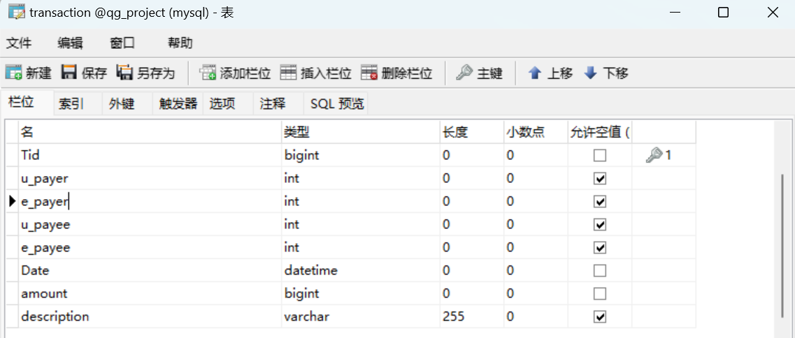
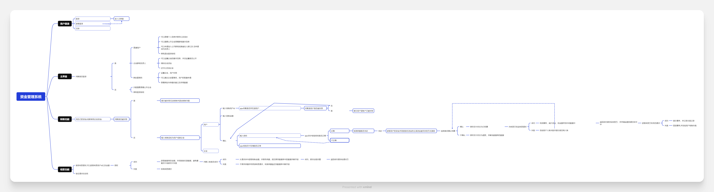
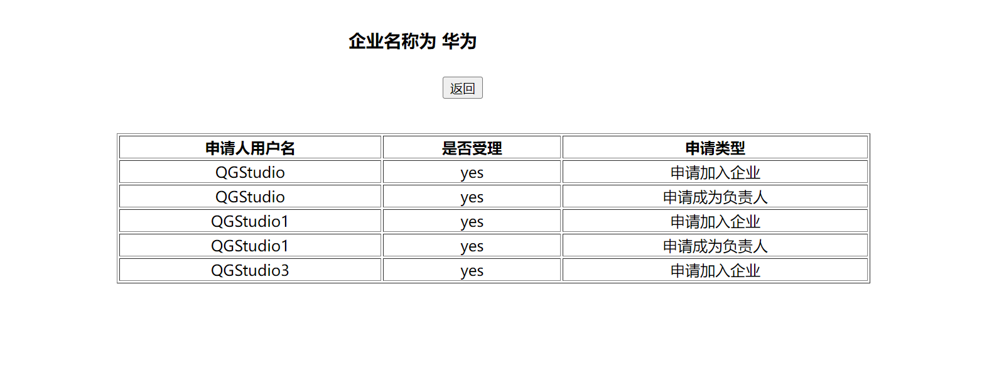

# QG资金管理系统

### 2024.4.14

#### 建表思路

建立数据库建立了四张表

enterprise 表格用来存储企业的id(系统自动分配作为主键) 企业名称，企业人数，企业规模，企业方向，公开模式，总资金,以及是否被封禁


user 表格用来储存用户的id(系统自动分配作为主键)，用户名(唯一，用户自己输入)，用户姓名，用户密码,用户的头像url(系统会分配默认头像),手机号码，个人资金，以及是否为网站管理员(默认为no)，以及是否被封禁


relation 表格 用来存储用户与企业的关系 rid(系统自动分配) 用来存储每一个唯一的关系， 存储用户id 企业id 以及 用户是否为企业群组管理员 以此可以使得用户可以同时加入多个企业而非固定一个企业，以及企业分配的企业资金


transaction 用来存储流水信息，内置一个账单id(系统自动分配),以及支付者id，收款者id(均有一个用户id和企业id)两者不能同时为空,交易时间，金额，交易描述



用户需要自己的流水账可以通过查询u_payee和u_payer的条件进行查询并获取数据发送给前端展示数据

通过以下sql语句设置联合约束用户id和企业id不能同时为空

ALTER TABLE transaction ADD CONSTRAINT CheckNotEmptyUnique CHECK (u_payer IS NOT NULL OR e_payer IS NOT NULL);

---

#### 做出了整体架构

具体知道某一部应该如何做



思考了转账的具体实现过程


#### 做出了登录注册功能

同时用正则表达式判断输入是否合法，同时在注册新账户时候，用ajax异步请求调用数据库查询数据判断该用户名是否存在，并在非法输入的时候无法提交表单数据，并设置了游客登录的方式，游客登录到主界面后仅仅有查询公开企业的功能 和登录功能


#### 主界面

游客登录仅有登录功能与查询公开企业功能

普通用户登录则用户查询企业以及申请加入等功能

构思：通登录界面获取的表单数据来判断是否登录以及身份信息等

目前需要是通过登录界面提交表单跳转到主界面的，主界面网页有请求体的数据，但是目前不知道如何从网页中获取请求体数据

---


### 2024.4.15

#### 9：30承接昨天内容主界面

在登录界面已经主界面之间的用户信息，通过设置cookie将用户信息保存到客户端，以此来记录客户是否进行登录，以及辨别其身份等信息

要模拟两个用户之间的收付款可以通过开两个浏览器登录两个账户，不同浏览器的cookie并不相通，不使用session的原因是session是保存到服务端的，且会区分浏览器，但是存在多个用户用同一个浏览器登录账户的情况，这样session便无法辨别哪个用户登录的是哪个账户，易引起混乱，因此需要使用cookie将数据保存到客户的客户端更容易辨别账户信息

#### 11：00获取用户信息

判断是否为游客，用ajax发送异步请求查找是否登录，对div的内容进行更改增添一个登录超链接以便用户登录


若为普通用户，则增添一个查看个人信息的按钮以及，退出登录按钮，退出登录由弹窗确认，防止用户误点击。但是目前展示个人信息的页面尚未做出来(退出登录是与游客登录的代码逻辑相同，若存在username的cokkie则将其值改为空字符串,使得主界面无法获取到用户信息)


#### 12:40建立用户信息查询表

建立信息界面的时候发现用户的资金应该存在小数位，之前的简表不够严谨，因此将数据库中的long类型改成double类型,同时也更改了其他表中有关资金类型的数据均将long改成double类型

#### 14:30发现一处bug并修正

在注册账户界面发现手机号码并没有保存到数据库中使得数据库的信息不完整，通过debug的方式发现写错了某些变量值，并且发现html更改后重启服务器服务器的页面依旧没有发生改变，通过查阅资料得知可以使用CRIL+F5的方式强制刷新网页得以解决该问题

#### 15:39实现了用户个人信息查询的基本界面


设置了一个默认头像

#### 16:05设置了更改用户的界面并设置了正则表达式

用户可以选择更改信息或者不更改信息，更改信息则受到正则表达式的影响而进行规范的输入，若不更改的信息则不受正则表达式的影响，不会产生提示，在后端更改数据时面临问题，存在多个要更改的变量要判断前方是否存在更改的过程太过于繁琐，即前方有进行更改则需要在字符串前加一个逗号，判断条件过于繁琐

#### 19：30对代码进行改进

由于无法使用mybatis框架 因此使用在第一个字段中 确定一个已知的值，即username = 原来的值然后后面需要更改的值统一加上逗号，可以减少繁琐的条件判断，在实现该想法之前先使用mysql进行尝试


通过mysql可以看出该想法确实可行因此对代码进行改进

#### 20：42用户信息更改

完成了对用户信息更改的代码测试，一切暂时还正常，但是还没搞出可以更改头像的代码,目前已知可以用file的type类型来选择文件，但是不知道如何获取选择文件的路径

通过查询资料知道可以通过JavaScript获取文件路径


可以通过这个代码来获取读取的文件路径(注意！！这里需要将jquery对象化作JavaScript对象，否则无法获取到文件路径)

实现如下：


#### 21：00头像更改实现

完成了头像更改的后端代码，并进行了代码调试，证明该后端代码目前可以满足更改头像的业余要求并将该数据保存到数据库中

#### 21：30发现bug

打脸瞬间，更改用户信息时候出现bug导致密码变成null 因为只判断是不是为null没有判断是否为空字符串，此后更改成功，解决一处bug。 

然而头像更改并无法持久保存本地文件的头像，重启服务器后图片无法加载出来，尝试修复bug

#### 22:00

打算暂时通过输入图片url的方式来更改头像修复该bug，后续有所更改再加以补充


重启服务器后发现可以成功保存头像并显示，暂时通过这个方式解决该头像更改的问题(后续有时间则重新改进一下)


#### 22:40

今日解决了主界面的设计以及代码实现，还有用户数据的更改和头像更改，修复了部分bug，解决了主界面如何获取用户数据的方式即cookie保存，明日计划完成企业功能的完成，包括：查看企业内容，加入企业，退出企业等功能，以及通过表格发生ajax发送异步请求给服务器查询所需要的企业，并完成主界面分页功能

---


### 2024.4.16

#### 实现企业界面展示以及加入企业功能 

#### 10:30

在思考查询企业详情时，发现并没有添加企业的介绍，因此考虑更改企业的表格添加一个基本介绍的column

#### 11:20

制作了查询企业数据的demo，后台已经成功获取并查询到结果并将结果集以json的方式发送给前端了，目前出现一个前端获取json数据的错误,暂时无法提取前端发送过来的json数据

#### 12：30

解决该问题用list集合传输json数据，属性名为pojo类中的属性名，因为没注意看导致出现错误，现在已经更正，能够正常提取企业数据了

现在打算在每一个企业后面设置按钮以此来查看企业的信息,

想法：通过给每个按钮设置一个class属性为research ， 可以通过jquery class选择器获取到该按钮，并且在该按钮的id设置为企业的id 获取按钮的同时可以获取到id并查询该企业的数据类型

#### 13:49企业信息表已经建立好

发现在主界面的查询按钮有问题，无法使用this.id()的方式获取id，导致按钮失效，开始尝试修复bug,查询遗漏点，$("#")中的this获取的是该按钮而不是按钮的jquery对象，需要用

```javascript
$(this).attr('id');来获取该按钮的id
```

#### 14:10

完成了对企业界面的完善，并且能够成功展示出企业数据，目前剩余加入企业的功能尚未完成，待完成


#### 16:30申请加入企业

在申请加入企业的程序中，思考到，需要创建一张表来存储该数据，以此使得管理员能够在需要的时候获取到该申请数据，因此新建一张申请表。同时想到发送转账请求也需要保存在一张表中，但是目前尚未做到该部分，尚且先不建立表格


建立了一个申请表格用来储存申请数据，并且有一个是否受理的column，以此来判断该申请是否成功受理

在申请加入企业的业务逻辑中，发现不仅需要判断该用户是否已经在该企业中，同时要判断该用户是否已经发送了一个未审理的请求，以防止一个用户发送了过多相同的请求导致数据库数据重复数据过多，数据过于冗余，因此在前端要用两个嵌套的ajax判断是否已经是该企业的成员以及发送申请加入企业的请求，后台则需要进行多重判断，保障数据的严谨可行。

#### 17:00完成了申请加入企业的代码逻辑

并且防止了用户多次发送请求导致服务器数据过大而崩溃，控制了数据库的稳定性


#### 17:40优化demo

发现只需要在加载界面的时候判断是否为成员以此来决定是否出现申请加入企业的选项，因此无需用两重ajax请求来判断，减少了代码的数量，并且在发现该用户是企业成员时提供一个退出企业的功能，并且有二次确认的窗口防止用户误触，退出企业后会重新加载页面，使得重新出现申请加入企业的功能


#### 18:00改进表格

发现企业成员需要拥有一个申请成为企业负责人的按钮，由于都是用户与企业之间的关系，因此更改先前创立的表格application 增添一个description的Column以此来描述该申请的类型


#### 20:00

实现了对企业用户申请成为企业负责人的按钮，并且后台方面也能实现该业务，业务逻辑与申请加入企业的逻辑相同，只是多添加了一个变量，更改了表格中描述的对象以便分辨申请类型并且能够分辨出是否为同一类型的申请，以防重复申请，引发数据库崩溃

#### 20:32

实现了对企业负责人与企业成员的分辨，企业负责人具有设置企业信息，分配企业资金的功能，而企业成员暂时没有.


#### 21:00设计修改企业信息页面


#### 21:30

根据测验发现企业修改信息的demo无问题，可以正常运行且可以更新数据


#### 21：47

给企业负责人增添一个可以查看申请的功能，以便增加新的企业负责人

目前该功能尚未成功

#### 22：20

本日完成了企业展示企业设置，已经不同企业用户进入企业界面的不同展示，并设置了申请进入企业的功能，但是查看申请功能已经审批功能尚未完成，明日完成审批功能，而后开始着手于转账功能。

---


### 2024.4.17

补充完成昨日未完成的查看申请功能以及审批功能，并着手于转账功能(感觉是最难的一部分)

#### 14:50

完成了申请功能的界面以及判断是哪个企业的申请功能，但是同意申请与拒绝接受申请功能尚未做成有待加强


#### 15:30

点击同意按钮后，要改变申请表中的数据，并且，后台要判断是为加入企业还是成为负责人的申请，根据不同的申请类型，对企业与用户表进行增添或者更改.

#### 15:55

发现先前建表是以企业与员工关系是以员工id和企业id进行保存的，然而在服务器中流动比较频繁的是员工的用户名，因此更改企业员工关系表为员工姓名与企业id的关系.


由于先前有使用过relation表格所以需要更改一些代码于先前的方法中

#### 16：30

完成了对申请类型的判断，以及申请加入企业的后台demo

并能使得负责人审理申请，并对数据库进行更新，完成业务需求(即申请加入企业则增添企业员工关系表，增添企业id 和员工信息这一栏目，而申请成为企业负责人则更改企业员工信息表，将对应企业的员工信息是否为负责人一项改为yes，因此加之身份为企业负责人)


还能查看以往已经审理过的申请，分开申请表的原因是以防历史申请数据过多，影响新申请的展示，影响审理申请的效率，因此分开两个申请表



#### 20：00

完成了对企业的查询功能，分页功能尚未完成，暂时先放一放，优先完成资金转账功能


同时也实现了注销企业的功能：展示如下，该注销企业的功能会将企业完全信息完全删除，并且企业与员工之间的关系信息 已经与该企业的请求均会删除。


#### 20:40

成功通过查询企业员工关系查找到企业id，再根据企业id查找所属企业，并展示再主界面


同时可以判断没有所属企业的用户，并且不对当前页面进行修改，提高demo

效率

#### 21:30

发现bug并修复，即当用户即使不登录直接进入主界面，且并非游客登录，会导致异常出现，即被认为是正常用户，并显示，已经修复了该bug，并且修复了游客可以对企业发起申请的功能，游客对企业发起申请会在后台被拦截下来，并返回404响应头，防止无用的数据浪费空间.

#### 22:29

完成了企业负责人拉人的功能，并且可以判断该用户名是否存在，若是不存在，则弹出提示，判断完用户名是否存在后，还能判断该用户是否属于该企业，若是属于该企业则弹出另一种提示，若成功拉进人，则提示用户已经拉进去了


目前企业部分只剩下分配企业资金部分以及企业负责人对于企业的流水的查看尚未完成

日后将往资金模板方向开始努力，尽快完成资金模块，毕竟资金部分难度较高，目前尚未对这方面着手，毕竟这是对于两个用户之间的一种交互模式，需要用户之间相互发送请求来达到最终目的.

#### 今日总结(22:40)

今日由于上课缘故，早上并没有时间写代码，因此今日仅仅完成了企业负责人的申请功能和审批功能，以及对申请表进行分类，以此提高工作效率，并增添了拉人功能，还有主界面的根据名称查询功能也已完成，目前进度并不快，但是尽力而为之，明日优先将企业分配资金部分完成，而后开始挑战资金模块

资金模块当前尚未有想法，虽然思维导图已经建成，但是实现并不简单，希望明天可以有所领悟,目前已经对于思维导图部分有预感后面有所更改

---

### 2024.4.18

#### 10:07

企业资金的分配功能的思考:首先确保所有人分配后的资金总和不能大于企业的总资金，因此在分配完成确认之后，需要有对两笔资金进行比较，防止资金泄露，导致了数据的异常，目前仍在思考分配后企业总资金是保持不变还是减少比较合理;

==想法1==：企业总资金保持不变，当企业成员消耗了企业分配的资金时候，在数据库中减少该成员所分配的资金的同时减少企业的总资金，不过这个在减少企业总资金的过程中存在着多线程问题，需对多线程问题进行处理，防止发生资金的泄露与溢出，导致对不上账

==想法2：==分配完资金减少企业总资金的情况，虽然不用考虑多线程问题，但是每次要重新分配资金的时候，需要将分配的资金返还给企业再进行分配，防止企业总资金的数据异常

考虑到一个企业的人数比较多，想法2或许会导致数据量过大，不易分配资金，因此选择使用想法1更为合理可行，因为相比较与想法二，想法一仅仅需要考虑多线程问题，可以减少对服务器的压力。

#### 10:45

> 对资金模块的新思考

在考虑资金分配问题时，对资金模块有了重新的思考，即一开始的想法为将资金

用事务来控制资金的流动，但是由于审题问题，其实已经提示我可以将资金暂存到第三方，且先扣除该用户的资金，并对资金进行解冻，而后根据第三方的支付情况来判断，因此我只需要对原来的transaction表格进行一定修改即可，即增添一个是否受理的column，根据该栏的值，来判断入账成功则为Yes，这样无需再次修改付款用户的资金，入账失败(即目标用户拒绝了该转账请求)则为False，同时需要将付款的资金返还给数据库因此，在判断入账失败后需要冻结目标用户资金，并返还该资金。当用户重新进入转账界面时候，会接受到转账信息，因此要判断是否用户已经接受过该转账结束的提示，所以要在原来的transaction表格再次修改一项是否提示的功能，当收款方对该入账进行处理时，将是否已经提示的栏目改为"no"，防止遗漏提示，当付款方进入转账功能时候，弹出该提示，并告知用户该次转账是否成功，并将该提示栏目改为"yes"，防止多次提示，用户还可查看转账明细，可以对入账失败的申请进行再次请求，但是需要重新判断资金金额并重新输入支付密码。

以下是思维导图更改部分


#### 11：00

考虑到有退出企业的机制，因此原先的企业资金分配机制还是想法1更为方便，因为当用户退出企业时，将该用户与企业的关系部分之间删除即可，同时分配的资金部分也被删除了，但是由于企业总资金并未更改，所以直接将其数据删除即可，而想法二还需要将用户资金返还到企业总资金，过程更加繁杂，因此综合考虑来看想法一是更为合理的

#### 11：30

建立企业资金分配表，可以在内部更改企业资金


对资金的修改尚未完成，这仅仅是展示分配信息

#### 13：30

在建立资金分配表时发现，先前分配的资金使用的是bigint类型，现在改为double类型，以此可以获取小数位的资金

#### 16：19

完成了分配企业资金的功能，在修改资金部分会对分配完的资金与总资金进行对比，判断资金是否溢出，判断不溢出，则更改relation表中的数据，并告知负责人更改成功，否则提示更改失败，其中在输入资金的时候使用了正则表达式，可以判断是否非法输入，在前端筛选了合理的数据。但是该界面仍然有不足之处，当不点击修改键时确认键和返回键无效，但是当修改键点击过一次后确认键就会异常，即弹出错误提示信息，展示效果如下:


#### 17:00

打算补充用户可以增添企业的功能，即自己开创企业，成为企业负责人的功能，在主界面呈现

#### 17：50

完成了企业的申请业务，同时可以将申请人化为负责人的功能，并且修复了先前企业介绍文本框的bug 先前将id 错写成name 导致无法获取到该栏数据，目前已经恢复正常


#### 20：00

修改bug 发现先前修改企业名称并没有查询其他企业的存在，而企业和企业id两个都为主键，因此形成了联合主键，但是企业id始终不可能相同，但是修改表格对整体的影响过大，因此决定在修改和申请企业时候，对企业名称进行严格的筛选，以防出现相同的企业名称，引起数据混乱

即对先前企业相关的增加和修改的代码进行了完善，解决了一些不必要的麻烦

#### 20：40

现在开始着手于转账功能

更改表格transaction 将用户id 和 企业id  更改为用户名和企业名，因为这样更方便转账的对象的申请，因为一般都不知道对面id为多少，更容易知道对方用户名为多少，因此更改表格


#### 21:20

由于先前添加了约束导致无法更改表格信息，因此把表格transaction更改为transfer内容有小幅度变化


#### 22:00

在建立转账功能时候，需要对用户是否被封禁进行判断，而且当该用户被封禁后需要在主界面增添一个申请解封的按钮，但是这个数据需要保存到数据库中给网络管理员查看，网络管理员可以对该数据进行审批，因此需要再建立一个新的申请表格，用来保存用户或者企业申请解封的信息，建表如下:


发送申请后，is_accept默认为待定，网络管理员审批后，更改为yes或者no

#### 22：40

**主界面被封禁的用户可以发送解封申请，以及判断申请是否有所重复，防止数据重复**


**被封禁的用户进入转账功能会提醒用户被封禁并强行退出该功能返回主界面**


#### 今日总结

今日尚未到转账功能的实现，今日对于转账界面尚未思考完毕，由于需要先选择使用个人资金还是企业资金（选择哪个企业），而后选择转账用户，进而跳转到输入转账密码的界面，但是并不适合弄成三个界面，过于浪费资源，思考通过jQuery ajax发送异步请求的方式更改界面，今日尚未完成，待明日完成，且明日开始处理资金模块的问题。

---

### 2024.4.19

#### 12:57

完成了转账界面的资金展示，以及选择转账的来源(用户资金，企业资金)，并且可以选择某个企业中的资金


#### 14:58

思考在分辨是由企业还是由个人资金发起转账，可以在判断是个人的时候，将enterprise置为空字符串，传入后台后，可以判断enterprise来判断是用个人资金还是用企业资金支付，避免代码重复

通过控制前端enterprise的值，得以判断是否为企业方式支付

因此后端只需先编写一个代码来判断是否为企业支付来分辨


判断企业是否被封禁也做了


在html页面中我设置了一个showPay的变量，当选择个人资金时showPay为1

而企业资金时候变为0，当选择企业资金后企业判断未被封禁时候再将showpay赋值为0，通过showpay这个变量判断是否呈现转账界面

#### 16：54

后来发现这个变量过于鸡肋，因此只需要建立两个函数，一个清除转账界面，一个显示转账界面即可，因此该变量被删除

对支付界面进行了简单的呈现，大体的结构如下:


这是尚未利用ajax发送异步请求获取的界面，动态获取的界面后续会进行增添

#### 20:15

完成了对支付界面的动态绑定，以及对用户以及企业的分辨，通过再js中，使用一个全局变量，user_payee 以及enterprise_payee 当判断是用户为支付对象时，会将enterprise_payee置为null 若是判断为企业为支付对象同理可使得user_payee置为null，当转入后台时，只需要后台判断这两个哪个不为null即可

同时给transfer表格增添一个栏位，is_accept以此来判断这次转账是否成功，成功则为yes 失败则为 no，收款方尚未处理则为pending，通过这种方式来记录转账的情况

考虑到用户支付密码属于敏感内容，因此要对用户的支付密码进行加密处理(考虑采用哈希算法的方式处理密码).

由于此类敏感信息不适合与用户基本信息存放到一起，因此新建一个储存用户支付密码的表格.

#### 22:26

完成了对付款功能的多方面业务的处理，判断选择资金，然后选择转账对象为用户或者企业进行相应的调整，发起转账后，开始输入密码，对密码进行正则表达式矫正，密码只能为6位数字，且在后台会以那哈希加密的方式保存，判断密码是否正确


目前转账具体功能尚未实现，仅仅实现转账功能界面的展示，对实现发起转账请求的业务功能提供界面，但是尚未对当前支付环境进行判断，（即用户是否同一客户端登录）

#### 总结

今日完成转账界面的展示以及判断输入的合法性，只差发送请求给目标用户，以及将该数据存入transcation中，并保存起来，同时需要判断是用户转账给用户，还是企业转账给用户，还是用户转账给企业，还是企业转账给企业

不过今日突然发现，转账描述尚未展示，明日补充转账描述，以及完成转账功能。

### 2024.4.20

#### 15:30

实现了对转账信息的保存，即用户或者企业将资金转账给其他用户或者企业，该信息被保存到数据库中，并能够分辨出转账主体为哪个，并且可以记录发起转账的时间，并保存到数据库中，数据库中的数据如下显示：


对用户向用户，用户向企业，企业向用户，企业向企业的四种转账可能性都进行了包含，确保了转账的稳定性;

#### 17:25

完成了对转账功能的实现，以及资金的减少功能，使得账能对上，不会出现资金异常的问题出现，即更改了用户资金或者企业分配的资金减少(企业总资金减少)，但是前面出现bug导致耗费太多时间，即在js中判断两个值的大小时候没有将两个字符串更改为double类型导致逻辑判断出现问题，通过一个函数parseFloat(）即可将字符串内容转化为浮点型数据，比较出来的数据才更为真实

在实现代码时候发现一个错误，即对密码的判断时，sql语句有误导致无法正确的判断密码的正确性，如今已经更改过来，只需后续完成收款方对转账的申请是否接受，这个结果最终告知付款方，并对其资金进行修改
